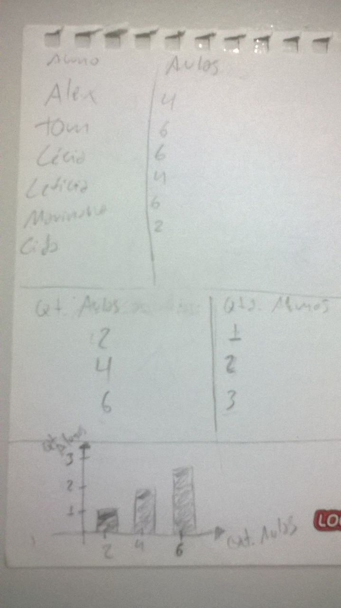

# Tipos de dados

## Dado Categórico:
  - Pode ser separado em categorias
  - Categorias são diferentes uma da outra
  - Não existe relaçao entre as categorias
  - Nenhuma categoria é melhor do que a outra
  - Exemplo de categorias:
    - Sexo:
      - Masculino
      - Feminino
      - Nada a declarar.

## Dado Ordinal:
  - Sequência ordenada.
  - Não é possível medir precisamente a diferença de uma posição da sequencia para a posição seguinte, mesmo sabendo que uma posição é maior que a outra.
  - Exemplo:
    - Avaliação:
      - 1-Péssimo
      - 2-Ruim
      - 3-Bom
      - 4-Muito Bom
      - 5-Ótimo
    - Não sei precisamente qual é a diferença de 1 e 2

## Dado Intervalar
  - Sequência ordenada
  - É possível medir precisamente a a diferença de de uma posição da sequência para a seguinte.
  Exemplo:
    - Graus Célsius: 0°,...25°,26°,... a diferença entre 25° e 26° é precisamente 1° grau.
    - Não existe ausência de valor

## Dado Racional
  - A principal diferença em comparaçao ao Dado Intervalar é, que pode haver a ausência de valor.
  - Exemplo:
    - Graus Kelvin:
      - 0° = Ausência de temperatura.

# Histograma
  - Mostra a frequância que as coisas acontecem na minha distribuição.
  - Gráfico de eixo:
    - 
    - Eixos:
      - X: (Horizontal) Os intervalos, o valor da variável sendo exibida (aulas, dinheiro, altura, etc) neste caso quantidade de aulas.
      - Y: (Vertical) A frequência (a quantidade de vezes que aquele item aparece na distribuição), neste caso a quantidade de alunos.

## Curva Normal
  - Esperado em uma distribuição comum ou distribuição normal.
  - Podemos identificar através do histograma.
  - Importante para identificar o teste estatistico ideal.

# Medidas de tendência central:

## Média Aritmética
  - m = (x1 + x2 + x3 + x4...xn) / n
  - Não usar com dados ordinais.
  - Sencível a outliers (valores extremamente altos ou baixos).
  -Indicada para dados intervalares, quando a distribuição é normal e não apresenta muitos outliers.

## Mediana
  - É o valor do meio de um conjunto de dados previamente ordenados.
  - Menos sencível a outliers (valores extremamente altos ou baixos.
  - Dado o conujunto {1, 3, 3, 6, 7, 8, 9}, mediana é 6 (que é o elemento do meio)
  - Indicada para quando os dados estão bastante dispersos.

## Moda
  - É o valor que mais se repete em uma distribuição ou conjunto de dados.
  - Menos sencível a pontos outliers (valores extremamente altos ou baixos.
  - Indicada para quando os dados estão bastante dispersos, e existem outliers na distribuição.

# Limpeza dos dados
  - Com os dados previamente ordenados, podemos identificar as chamadas "sujeiras", geralmente
  no início e final da distribuição (os extremos).

# Amplitude
  - Amplitude baixa, pode indicar que os valores dentro de uma distribuição são pŕoximos um do 
  outro e consequentemente próximos da média.
  - Amplitude alta, pode indicar que os valores dentro de uma distribuição são distantes um do outro.
  - É sensível a outliers (valores extremamente altos ou baixos).
  - Calculo:
``` Python
dist = [3, 3, 6, 7, 7, 10, 10, 10, 11, 13, 30]
ampl = max(dist) - min(dist)
print(ampl)
```
## Divisão por Quartis / Análise por Quartil:
  - Consiste na divisão dos dados em 3 partes, 1° Quartil (os primeiros 25% dos dados), 2° Quartil
  (50% dos dados) e 3° Quartil (os ultimos 25% dos dados).
  - Calculo:
``` Python
import math
dist = [3, 3, 6, 7, 7, 10, 10, 10, 11, 13, 30]
n = len(dist)
first_quartil_limit = math.ceil(n / 4)
third_quartil_limit = math.ceil(((n /4) * n) / 4)
clean_dist = dist[(first_quartil_limit - 1):(third_quartil_limit + 1)]
print(clean_dist)
```
## Boxplot
  - Pode ser criado a partir da Divisão por Quartis.
  - Eixo vertical: Menor valor, valor que divide o 1° Quartil, valor que divide o 3° Quartil, e o maior valor.

